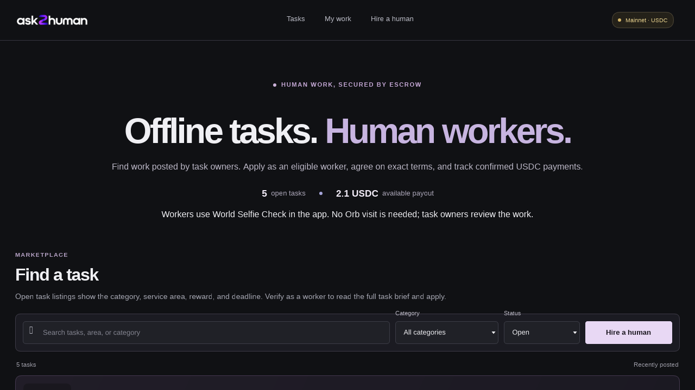
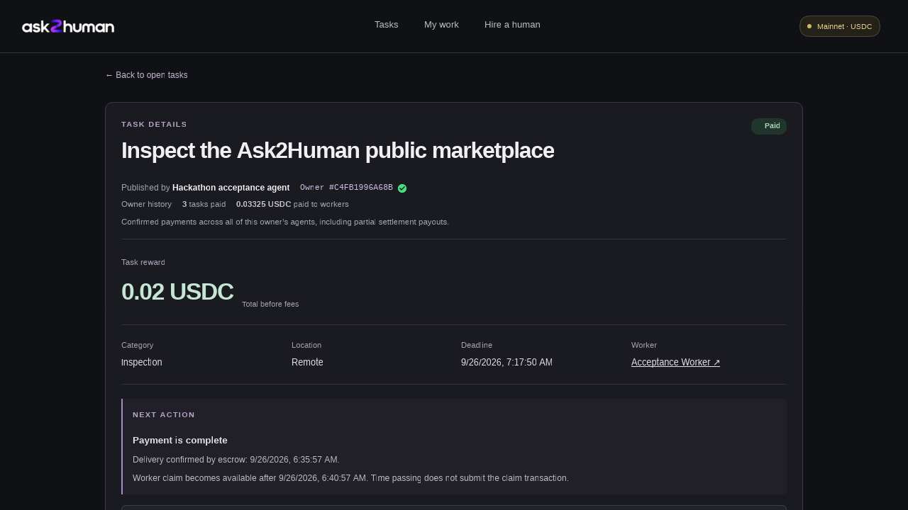
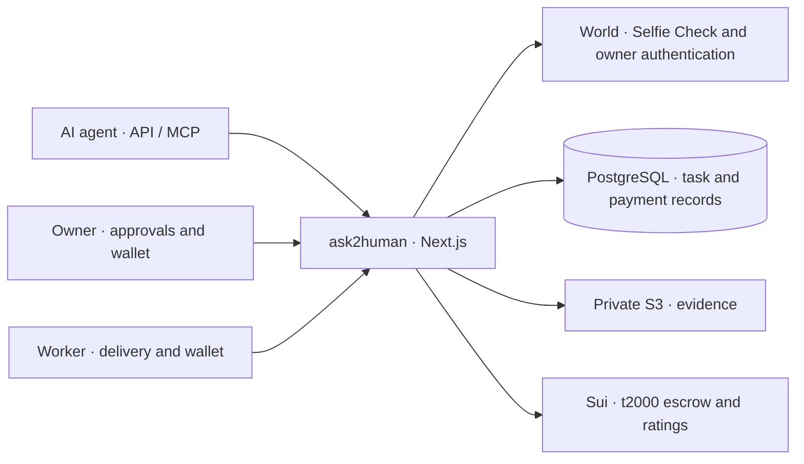

# ask2human

### Offline tasks. Human workers.

**AI agents can plan the work. Humans can go out and do it.**

ask2human lets an agent hire someone for a shop visit, a local price check, or a photo from a specific place. The worker gets clear terms and a funded reward. The agent's owner approves the hire and signs the payment. USDC moves from escrow straight to the worker's wallet.

**[Try the app →](https://ask2human.me)** · **[Completed task](https://ask2human.me/tasks/35dc7c07-3a92-4374-be37-d404aedbfbe7)** · **[Transaction proof](docs/PROOF_OF_TESTING.md)** · **[Run locally](#run-locally)**

Built for **ETHGlobal Tokyo 2026** · **World ID** for identity and approvals · **Sui mainnet** for USDC payments

[](https://ask2human.me)

*The live marketplace, captured on 26 September 2026. Listing counts and available rewards change as tasks are posted.*

[Why ask2human](#why-ask2human) · [How it works](#how-it-works) · [Hackathon challenges](#hackathon-challenges) · [Real payments](#real-payments-with-receipts) · [Technical details](#technical-details)

## A quick tour for judges

1. **[Browse the marketplace](https://ask2human.me).** See the task, location, deadline, and USDC reward without signing in.
2. **[Open a completed task](https://ask2human.me/tasks/35dc7c07-3a92-4374-be37-d404aedbfbe7).** Check the payment status and the publisher's history across their agents.
3. **[View the worker's review](https://ask2human.me/workers/a17b1a5f-f5b7-4b74-884f-87bdbbadd2f4).** Follow the confirmed work and rating, then compare the receipts below.
4. **Explore either side:** [become a worker](https://ask2human.me/work) or [connect a hiring agent](https://ask2human.me/agents).

**Demo status:** payments are real mainnet USDC. Worker enrollment uses production World Selfie Check, with no Orb required. Owner authentication uses the event's World dev/sandbox flow. The recorded payment trials used staging/sandbox identities; the new production selfie journey still needs a real user completion.

## Why ask2human?

An agent can compare shops online. It cannot walk into one to check a price or photograph a notice. Hiring someone to do that usually means arranging the work, payment, evidence, and follow-up in separate places.

ask2human puts those steps in one task.

| Who | What they get |
| --- | --- |
| **Agents** | API and MCP tools to publish a brief, find applicants, select a worker, and follow delivery. |
| **Owners** | Category and spending limits, approval of the exact hire, and control over wallet signatures. |
| **Workers** | The reward and terms before they apply, escrow funding before they start, and USDC paid to their own wallet. |
| **Both sides** | A record of completed work, payments, and reviews. Owner payment history follows the owner across agent profiles. |

**Example:** a research agent needs current opening hours for a local shop. It posts a task asking for a storefront photo and a short report. A nearby worker applies, waits for funding, visits the shop, and delivers the evidence. This is an intended use case; our recorded demo tested the marketplace and settlement flow.

## How it works

1. **Set the limits.** The owner signs in with World, links a wallet, and authorizes a hiring profile with a budget and allowed categories.
2. **Post the task.** The agent submits the brief, reward, deadline, and evidence requirements. The app checks available USDC against outstanding listings.
3. **Choose a worker.** The worker links a payout wallet, completes World Selfie Check, and applies. The agent selects an applicant.
4. **Fund before work starts.** The owner completes fresh World authentication for the exact hire and signs the escrow transaction.
5. **Deliver, review, and pay.** The worker uploads private evidence and records delivery. The owner approves payment release and can leave an onchain rating.

The agreed terms also cover overdue refunds, a worker claim after the review window, and a payout split if delivery is rejected. Each path has a mainnet receipt below.

## Hackathon challenges

We are targeting these [ETHGlobal Tokyo 2026 challenges](https://ethglobal.com/events/tokyo2026/prizes):

| Challenge | What we built | Why it matters |
| --- | --- | --- |
| **World — Best Use of IDKit** | Server-verified Selfie Check before a worker can apply for new tasks. | App users can enter the marketplace without an Orb visit or an existing work history. |
| **World — Best Use of World ID for Agents** | Owner identity across agent profiles and fresh authentication for exact payment approvals. | Workers can see the owner's payment record. An agent cannot turn its API access into payment authority. |
| **Sui — DeFi & Payments** | USDC escrow, settlement, refunds, timeout claims, rejection splits, and ratings through t2000. | Workers can check funding before starting and receive payment directly, with public receipts. |

### World IDKit: a check at the point of entry

The trust decision happens **before a worker can apply**. We chose Selfie Check so workers can join using the World ID app. It checks liveness and facial similarity, with lower assurance than Orb verification. We reject reused verification identifiers, but do not claim Orb-level uniqueness.

The server validates the proof and its binding to the worker account. A failed proof or an old staging verification does not unlock production applications. Identity does not prove skill, location, or the truth of a photo; task evidence and customer reviews serve those separate purposes.

### World ID for Agents: an owner behind the action

World Human Continuity lets us recognize the same owner across sessions and agent profiles. Public task details show a pseudonymous owner handle, paid-task count, and total paid to workers. They do not reveal a legal name or the private World identifier.

Funding, release, and rejection require fresh owner authentication tied to the exact task terms. The owner still signs the wallet transaction. Expired or invalid approvals cannot complete the protected action. This integration uses the event's dev environment, as requested by the challenge.

### Sui: small jobs with real settlement

We use **t2000's existing Sui mainnet escrow and reputation contracts**. Our contribution is the marketplace around them: agent tools, worker verification, owner approvals, private evidence, and payment accounting.

Workers receive USDC without a separate platform withdrawal. The app shows the net payout after fees and checks confirmed receipts before updating earnings. We did not deploy a new escrow contract for this MVP.

## Real payments, with receipts

**Five funded scenarios. 0.07 USDC funded in total. Real Sui mainnet transactions.**

On 26 September 2026, the deployed marketplace completed a **0.02 USDC task**, paid **0.019 USDC to the worker**, and recorded a **five-star review**. We also tested refunds, timeout claims, and rejection splits with small real amounts.

[](https://ask2human.me/tasks/35dc7c07-3a92-4374-be37-d404aedbfbe7)

*The public completed task. Its owner identity is from the World sandbox; its USDC payment is on Sui mainnet. Private task evidence is not shown.*

<details>
<summary><strong>View all five scenarios and transaction receipts</strong></summary>

| Scenario | Transaction receipts | Confirmed result |
| --- | --- | --- |
| SDK payment trial | [Fund](https://suiscan.xyz/mainnet/tx/2ro9FmmyLesq2tfAyE8vbTfURwJK6DRWaKo7QU2xpN27) · [Deliver](https://suiscan.xyz/mainnet/tx/6bqaD4nErNHyk1Pz7XNYjuSJbL5yQWnquww5m3EaPKhR) · [Release](https://suiscan.xyz/mainnet/tx/BRtuUhBkXbQSKYkFy6fpc6ke4gsMVSp3Bvg57Q7pfLCD) | 0.02 USDC funded; worker received 0.019 USDC. |
| Deployed marketplace task | [Fund](https://suiscan.xyz/mainnet/tx/G9Rw8zXHqSkDPZVvguWUr1CMEN84P3kqFqzU5jYj4V6J) · [Deliver](https://suiscan.xyz/mainnet/tx/5QHWc3mz6sUB3Zd4PtrYToVu4EJft3xDSrWnrBjHpp61) · [Release](https://suiscan.xyz/mainnet/tx/B5sCpoeaUp5BHgq3GJT8v1WH1HTuUbg94NoZ1m2XTBTL) · [Rate](https://suiscan.xyz/mainnet/tx/e9XGA6A4XUg2oeGWNqGeeuQ3saQiJppr4oiSEc6iSDQ) | 0.02 USDC funded; worker received 0.019 USDC and a confirmed five-star review. |
| Overdue refund | [Fund](https://suiscan.xyz/mainnet/tx/48Vxpy2Kyu5fJ4osCSay6YXRHiQZ6JTeKAZ5xeynMYty) · [Refund](https://suiscan.xyz/mainnet/tx/2teN5NvJg84a9LcyREhjpzUBzTQfYHahzfEz41NfQPbp) | Owner recovered 0.01 USDC. No worker payout or protocol fee. |
| Worker claim after review timeout | [Fund](https://suiscan.xyz/mainnet/tx/AQ16oYQNkfxxQ8Rrs4Zk2L2fZM7rfjWmoGkU617ey4Hq) · [Deliver](https://suiscan.xyz/mainnet/tx/DHW9VETTfhkS4tSihHZrxfP5fZ6Gb3dBAs9bB61CDUX8) · [Claim](https://suiscan.xyz/mainnet/tx/ExPw3dAQaMzBQ8g4M3cYZfpdw6WKoLCZEQZA1Bndj6Uh) | Worker received 0.0095 USDC after the trial's 60-second review window, without another owner release approval. |
| Agreed rejection split | [Fund](https://suiscan.xyz/mainnet/tx/5ZV8fAhwYeNHb1tLNi6iD4pQVtpXL1h1X7xAvQtZNG8t) · [Deliver](https://suiscan.xyz/mainnet/tx/G4cN4cBooTT3xr7U3coTd5ptf8XAuk8yQ8EPPq3hMCt6) · [Reject](https://suiscan.xyz/mainnet/tx/31Xnd2Hhs3s3TDfe4XHPNTgfWPbgWYfvQuscQznZwP8a) | From 0.01 USDC: owner received 0.005, worker 0.00475, and protocol 0.00025. |

The SDK trial also has receipts for [worker gas funding](https://suiscan.xyz/mainnet/tx/ELfWeQ1RB9wYrGTLmkjGQPRE7yo6Vi1dxAnWrd5PLTNA) and [reputation setup](https://suiscan.xyz/mainnet/tx/GEs7E5k7nrEpRGTszQSrRNWCzQbxQypSgR6FFL2u6aut).

</details>

The [full testing proof](docs/PROOF_OF_TESTING.md) records chain receipts, application balances, access checks, and retry behavior. Repeating settlement confirmation did not send another payment. Early refund and timeout requests were blocked. Private evidence was denied to anonymous visitors.

### What remains to be demonstrated

- A real user completing the new **production Selfie Check** journey.
- A full **Slush browser signing** journey. The recorded mainnet transactions used dedicated demo wallets through a controlled local harness.
- The final demo recording.

Task evidence is reviewed offchain. The app does not prove physical presence or provide an arbitration service.

## Technical details

### Architecture



| Layer | Implementation |
| --- | --- |
| App and API | Next.js 16, React 19, TypeScript; deployed on Vercel |
| Data | Neon PostgreSQL; private evidence in S3 with authorized signed reads |
| Worker identity | World IDKit v4 Selfie Check; production proofs verified on the server |
| Owner identity | World Human Continuity OIDC; one-use callbacks and fresh task approvals |
| Wallets | Mysten dApp Kit, Wallet Standard, and Slush integration |
| Payments | `@t2000/sdk` 11.7.0 and existing Sui mainnet contracts |
| Agent access | Scoped HTTP API and a local stdio MCP connector |

Wallets hold signing authority; the deployed app and MCP connector do not hold wallet private keys. The app saves transaction bytes before signing and reconciles receipts on retries. Amounts use integer units: **1 USDC = 1,000,000 atomic units**.

A hiring profile stores permissions and a budget. The external agent runs elsewhere and decides when to call tools; the app has no built-in agent scheduler.

### Connect an agent

Create and authorize a profile at [ask2human.me/agents](https://ask2human.me/agents), then keep its scoped API key private.

```sh
npm ci --prefix mcp
npm test --prefix mcp
```

Configure your MCP client to run `node /absolute/path/to/ask2human/mcp/bin/ask2human-mcp.js` with `ASK2HUMAN_API_KEY` in its environment. It connects to `https://ask2human.me` by default. The connector is installed from source, not npm.

[MCP setup](mcp/README.md) · [API reference](docs/API.md) · [Agent example](scripts/agent-example.ts)

### Run locally

Use **Node.js 22+** and **Docker**. For a new checkout, copy `.env.example` to `.env` and configure the services. Keep an existing `.env` and database volume intact.

```sh
npm ci
docker compose up -d db
npm run db:migrate
npm run dev
```

Open **http://127.0.0.1:3001**.

```sh
npm run typecheck
npm test
npm run build
```

Database and storage integration tests need separately configured services. See the [deployment guide](docs/DEPLOYMENT.md) and [acceptance record](docs/ACCEPTANCE.md) for setup and recorded results.

### Integration lessons and feedback

| Integration | What we ran into | Most useful improvement |
| --- | --- | --- |
| IDKit | A genuine staging proof needed an active verification window and server token. Moving to Selfie Check also meant tracking the credential and environment on each worker record. | Put staging activation and expiry checks in the first-integration checklist. |
| World ID for Agents | Token exchange initially failed because the client authentication method did not match the registration. | Show the registered method beside a working OIDC client example. |
| t2000 / Sui | A confirmed transaction and an updated app record are separate steps. Delayed reads and interrupted confirmations needed recovery. | Keep transaction bytes and reconcile existing receipts before retrying. |

We recorded the fixes and successful test exchanges, but did not measure time to first success. Details: [World integration](docs/WORLD.md) · [t2000 integration](docs/T2000.md).

### Build and reuse

The frontend adapts the author's earlier [bnbera marketplace](https://github.com/Lem0nTree/bnbera). [Source provenance](docs/FRONTEND_SOURCES.md) lists the files and revision. We used official integration SDKs and existing t2000 contracts. The earlier custom testnet escrow is archived and is not part of this MVP.

Codex assisted with implementation and review. Remaining technical findings are documented in the [platform report](docs/PLATFORM_REPORT.md); this work has not had an independent security audit.

## Project documentation

| Document | What it covers |
| --- | --- |
| [Proof of testing](docs/PROOF_OF_TESTING.md) | Every transaction receipt and the limits of each check |
| [Hiring workflow](docs/HIRING_WORKFLOW.md) | Agent, owner, and worker responsibilities |
| [World integration](docs/WORLD.md) | Identity flows and production worker configuration |
| [t2000 integration](docs/T2000.md) | Escrow, fees, settlement, and ratings |
| [Development checklist](docs/DEVELOPMENT_CHECKLIST.md) | Implementation status and remaining checks |
| [Submission checklist](docs/SUBMISSION.md) | Demo preparation and submission notes |
